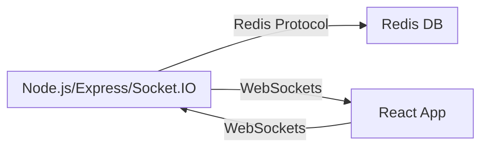

# Social Media Analytics

A real-time analytics platform for social media posts, featuring a modern React frontend and a Node.js/Express backend with Redis and WebSocket support. Designed for scalable, interactive analytics with robust CI/CD pipelines.

---

## 🚀 Features

- **Real-time Like Tracking:** Instantly captures and broadcasts "like" events to all connected clients.
- **Live UI Updates:** Modern React frontend receives real-time analytics updates via WebSockets.
- **User Auth & Post Creation:** Simple login and post interface for demo purposes.
- **WebSocket API:** Backend uses [Socket.IO](https://socket.io/) for fast, bi-directional communication.
- **High-Performance Backend:** Built on [Express.js](https://expressjs.com/) and [Node.js](https://nodejs.org/en).
- **Fast Data Storage:** In-memory [Redis](https://redis.io/) for atomic like counters.
- **Scalable Architecture:** Modular, containerizable (Docker support).
- **CI/CD:** Automated workflows for linting, testing, and deployment.

---

## 📦 Tech Stack

- **Frontend:** React (Create React App structure)
- **Backend:** Express.js + Socket.IO
- **Data Store:** Redis (with optional [RedisBloom](https://redis.io/docs/data-types/probabilistic/) module support for advanced analytics)
- **Runtime:** Node.js (18+)
- **CI/CD:** GitHub Actions (see `.github/workflows/`)
- **Containerization:** Docker

---

## 📁 Project Structure

```
social-media-analytics/
├── analytics-service/
│   ├── index.js           # Main backend server
│   ├── package.json
│   └── ...
├── frontend/
│   ├── src/
│   │   ├── App.js         # Main React App
│   │   ├── Login.js
│   │   ├── PostForm.js
│   │   └── Feed.js
│   ├── public/
│   ├── package.json
│   ├── Dockerfile
│   └── ...
├── .gitignore
└── README.md
```


---

## 🏗️ Architecture



---

## 🖥️ Frontend (React)

- Located in the `/frontend` directory.
- Built with React functional components and hooks.
- Example core file: `src/App.js`:
    ```js
    import { useState, useEffect } from "react";
    import Login from "./Login";
    import PostForm from "./PostForm";
    import Feed from "./Feed";

    // ... see code above ...
    ```
- Features:
  - Login flow (dummy for demo)
  - Post creation form
  - Live-updating social feed (likes update in real time)
  - WebSocket client connects to backend for instant updates

### Local Development

```bash
cd frontend
npm install
npm start
```

- The React app runs on port 3000 by default.
- Make sure the backend (`analytics-service`) is running (see below).

---

## ⚡ Backend (Analytics Service)

- Located in `/analytics-service`.
- See `analytics-service/index.js`.
- Express server with Socket.IO and Redis.

### Local Development

```bash
cd analytics-service
npm install
npm start
```

- Runs on port 4000 by default.

---

## 🔗 Connecting Frontend & Backend

- The React frontend communicates with the backend via HTTP (for REST endpoints, if any) and WebSockets (for live analytics).
- Socket.IO client connects to `ws://localhost:4000` (default).
- On "like" actions, the React UI emits events to the backend, which updates Redis and broadcasts new like counts to all clients.

---

## 🛠️ CI/CD Pipeline

This project leverages **GitHub Actions** for:

- **Continuous Integration:** Lint & test code on every pull request.
- **Continuous Deployment:** (Optional) Deploy automatically on main branch merges.
- **Code Quality:** Automated checks for dependencies and vulnerabilities.

Sample workflow steps:

- `npm ci`
- `npm run lint`
- `npm test`
- (Optional) Docker build & push
- (Optional) Deploy to cloud/VPS

See `.github/workflows/` for pipeline definitions.

---

## 🐳 Docker Support

Both frontend and backend have a `Dockerfile` for containerized builds and deployment.

### Example (build & run frontend):

```bash
cd frontend
docker build -t sma-frontend .
docker run -p 3000:3000 sma-frontend
```

---

## 🔒 Environment Variables

- Store sensitive config (like Redis connection strings) in `.env` files.
- Example for backend:
    ```
    REDIS_URL=redis://localhost:6379
    ```
- `.env` is gitignored.

---

## 📜 License

MIT

---

## 🤝 Contributing

Pull requests, issues, and suggestions are welcome! See [CONTRIBUTING.md](CONTRIBUTING.md) for guidelines (or open an issue if you’d like to add features).

---

## 🙏 Acknowledgments

- [Redis](https://redis.io/)
- [Socket.IO](https://socket.io/)
- [Express.js](https://expressjs.com/)
- [React](https://react.dev/)
- [GitHub Actions](https://github.com/features/actions)

---
