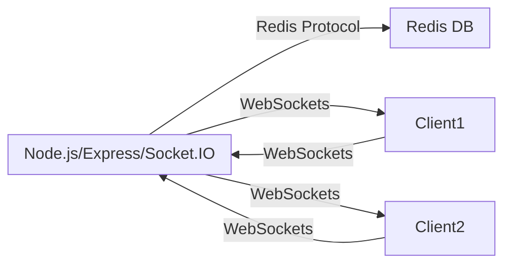

# Social Media Analytics

A real-time analytics service for tracking and broadcasting social media post likes, built with modern Node.js, Redis, WebSockets, and Express. Designed for scalability and performance, this project demonstrates how to build event-driven analytics with live updates and a robust backend architecture.

---

## 🚀 Features

- **Real-time Like Tracking:** Instantly captures and broadcasts "like" events across client applications.
- **WebSocket Updates:** Uses [Socket.IO](https://socket.io/) to deliver live analytics updates to connected clients.
- **High-Performance Backend:** Built with [Express.js](https://expressjs.com/) and [Node.js](https://nodejs.org/en).
- **Fast Data Storage:** Integrates [Redis](https://redis.io/) for in-memory storage and atomic counters.
- **Scalable Architecture:** Modular setup, ready for containerization and cloud deployment.
- **CI/CD Ready:** Automated workflows for linting, testing, and deployment.

---

## 📦 Tech Stack

- **Backend Framework:** Express.js
- **WebSockets:** Socket.IO
- **Data Store:** Redis (with optional [RedisBloom](https://redis.io/docs/data-types/probabilistic/) module support for advanced analytics)
- **Runtime:** Node.js (18+ recommended)
- **CI/CD:** GitHub Actions (see `.github/workflows/`)
- **Package Management:** npm

---

## 🏗️ Architecture



- **Clients** emit like events to the Analytics Service.
- **Analytics Service** increments counters in Redis and broadcasts aggregated stats in real time via WebSockets.

---

## 🚦 Local Development

### Prerequisites

- Node.js 18+
- Redis server (local or cloud)
- npm

### Getting Started

```bash
git clone https://github.com/yakitoritrash/social-media-analytics.git
cd social-media-analytics/analytics-service
npm install
npm start
```

By default, the analytics service runs on **port 4000**.

---

## ⚡ Usage Example

- Connect your frontend or test client to `ws://localhost:4000` using Socket.IO client.
- Emit a `like` event with a post ID:
    ```js
    socket.emit('like', 'post123');
    ```
- Listen for live updates:
    ```js
    socket.on('likeUpdate', ({ postId, likes }) => {
      console.log(`Post ${postId} now has ${likes} likes!`);
    });
    ```

---

## 🛠️ CI/CD Pipeline

This project leverages **GitHub Actions** for:

- **Continuous Integration:** Lint & test code on every pull request.
- **Continuous Deployment:** (Optional) Deploy automatically on main branch merges.
- **Code Quality:** Automated checks for dependencies and vulnerabilities.

Sample workflow steps:

- `npm ci`
- `npm run lint`
- `npm test`
- (Optional) Docker build & push
- (Optional) Deploy to cloud/VPS

See `.github/workflows/` for pipeline definitions.

---

## 📁 Project Structure

```
social-media-analytics/
├── analytics-service/
│   ├── index.js           # Main server code
│   ├── package.json
│   └── node_modules/
├── .gitignore
└── README.md
```

---

## 🔒 Environment Variables

- Store sensitive configuration (like Redis connection strings) in a `.env` file at the project root.
- Example:
    ```
    REDIS_URL=redis://localhost:6379
    ```

*Note: `.env` is already gitignored.*

---

## 📜 License

MIT

---

## 🤝 Contributing

Pull requests, issues, and suggestions are welcome! See [CONTRIBUTING.md](CONTRIBUTING.md) for guidelines (or open an issue if you’d like to add features).

---

## 🙏 Acknowledgments

- [Redis](https://redis.io/)
- [Socket.IO](https://socket.io/)
- [Express.js](https://expressjs.com/)
- [GitHub Actions](https://github.com/features/actions)

---
